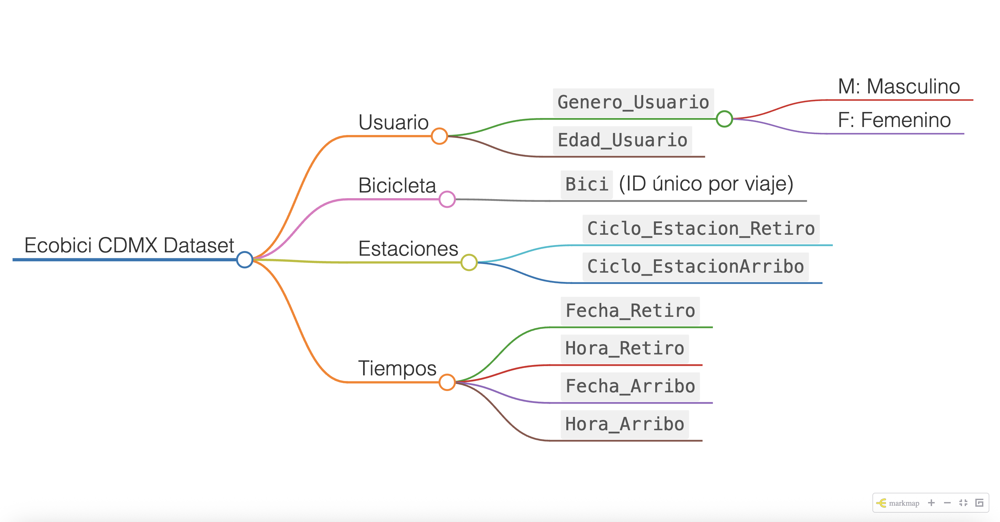

# Datos abiertos

## Datos en Tiempo Real

**ECOBICI** publica los datos del sistema en tiempo real sobre la disponibilidad de bicicletas y cicloestaciones con el estándar GBFS (General Bikeshare Feed Specification). Dicho estándar está diseñado conceptualmente para proporcionar el estado del sistema en tiempo real y, por lo tanto, no proporciona información histórica. La información se encuentra disponible a través de un feed en formato json, mismo que podrás acceder desde el siguiente enlace: [gbfs.json](https://gbfs.mex.lyftbikes.com/gbfs/gbfs.json)

Si deseas más información acerca del estándar de datos abiertos GBFS (General Bikeshare Feed Specification) consulta el siguiente enlace: [gbfs](https://github.com/NABSA/gbfs)

## Fuentes oficiales *ECOBICI CDMX*

El conjunto de datos de **Ecobici CDMX** contiene registros detallados de viajes realizados en bicicletas públicas, incluyendo información demográfica del usuario y detalles del recorrido. Cada fila representa un viaje individual y proporciona los siguientes atributos: el **género** del usuario (`Genero_Usuario`) y su **edad** (`Edad_Usuario`), así como el **ID de la bicicleta utilizada** (`Bici`). También se especifican las **estaciones de retiro y arribo** (`Ciclo_Estacion_Retiro`, `Ciclo_EstacionArribo`) junto con las **fechas y horas correspondientes** (`Fecha_Retiro`, `Hora_Retiro`, `Fecha_Arribo`, `Hora_Arribo`). Estos datos permiten analizar patrones de uso por horario, edad, género y ubicación, facilitando estudios de movilidad, demanda por estación y planificación urbana basada en evidencia real de comportamiento de los usuarios.

## Ecobici CDMX Dataset

## Aplicaciones

- Análisis de movilidad urbana
- Estudio de patrones por género y edad
- Demanda por estación y hora
- Planeación de infraestructura ciclista
- **Predicción**
  - Estimación de demanda futura
  - Predicción de rutas más usadas
  - Anticipación de horarios pico

  
